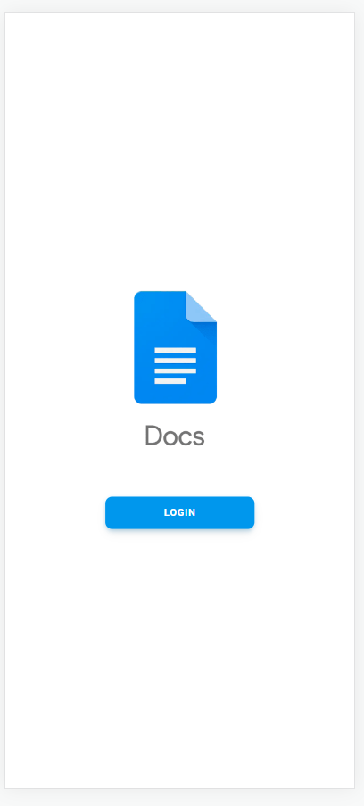
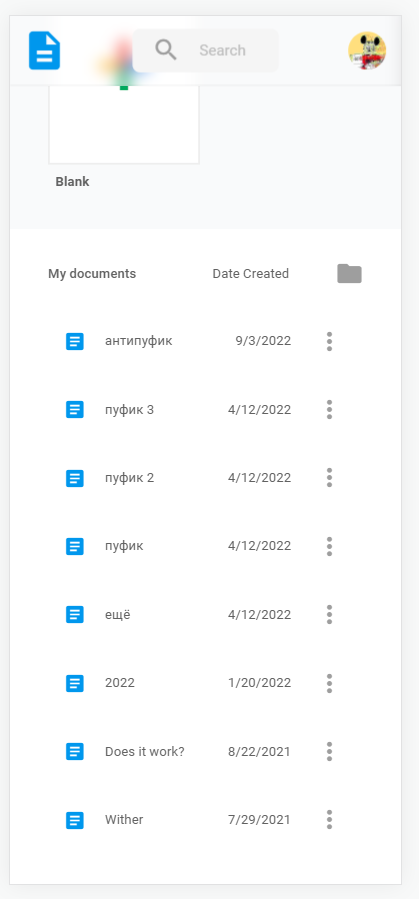
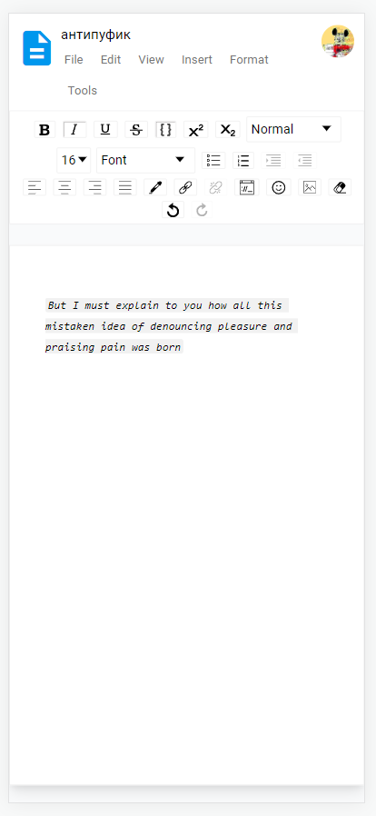

	<h1><a href="https://docsh.vercel.app/">Docsh</a></h1>
	

<h2>Information</h1>

Docsh is an online word processor.

	
<h2>Screenshots</h2>

	
	
	
  
## Tech Stack

- [React](https://reactjs.org/)
- [Next.js](https://nextjs.org/)
- [Material Tailwind](https://www.material-tailwind.com/)
- [Draft.js](https://draftjs.org/)
- [Firebase](https://firebase.google.com/)

<b> 📄 </b>
